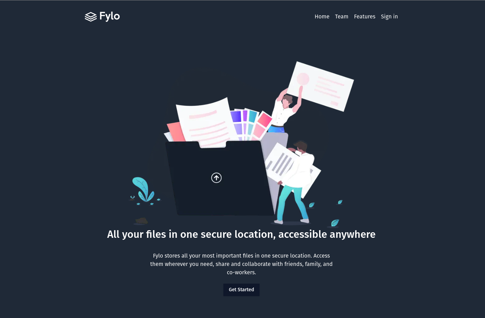
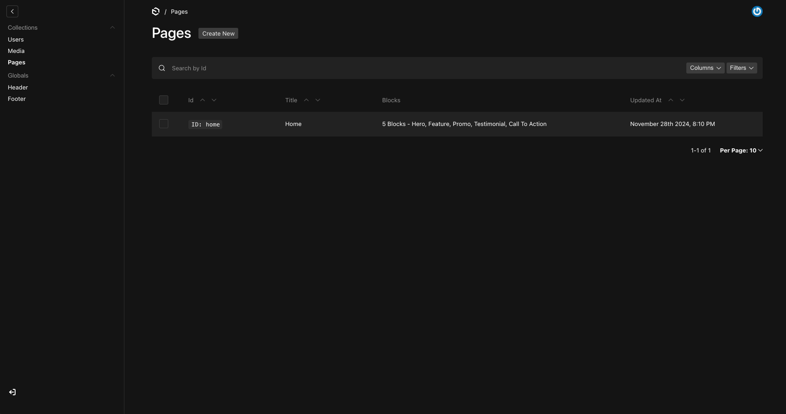

# Tina CMS

This project uses [Pauload CMS](https://payloadcms.com/) to manage the content of a static site generated Next.js site.

The design is roughly based on [This frontend mentor challenge](https://www.frontendmentor.io/challenges/fylo-dark-theme-landing-page-5ca5f2d21e82137ec91a50fd)

## Screenshot





## Local Development

Run the project locally:

```
pnpm dev
```

Build the project:

```bash
pnpm build
```
